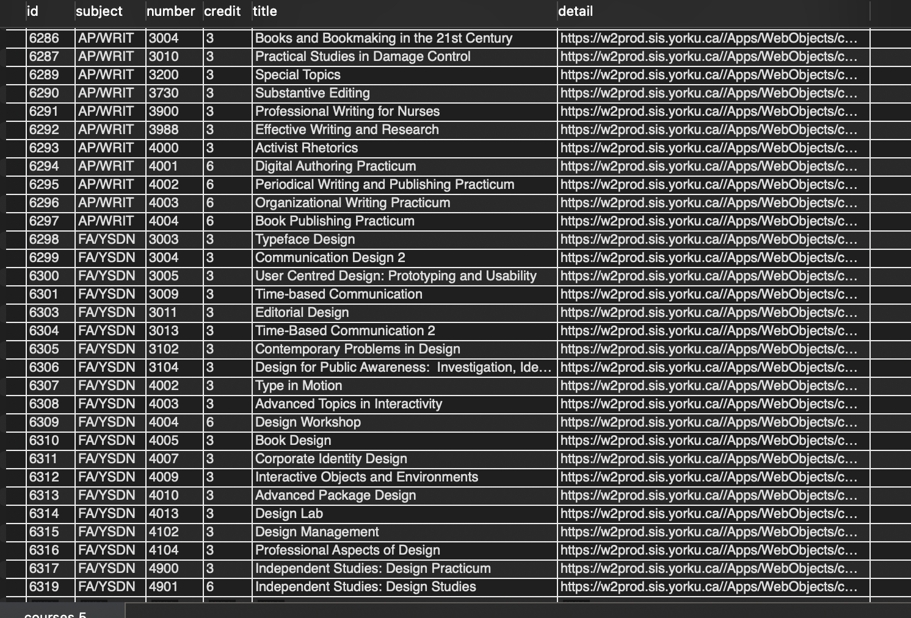

# webscraping-yorku-courses
Crawling through forms

### Difficuties

- Url changes dynamiclly
- Form method = post
## How to play with this project:
```
git clone this repository
create a new file json named db.json
store your mysql host, username, password, port info in json file
run store,py
```

